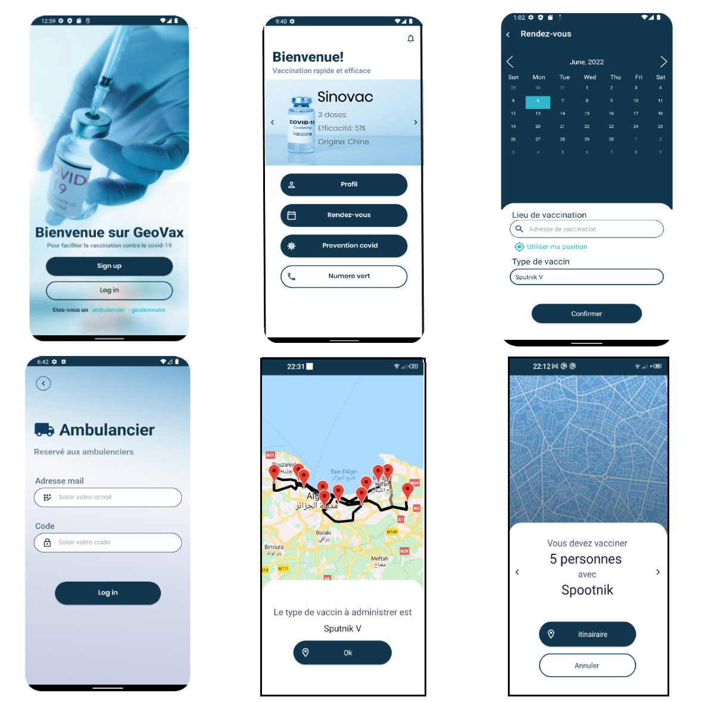

# Geovax 💉: AI-optimized vaccination appointment booking app 

With the events concerning the Covid-19, it became clear that increasing vaccination rates and optimizing the vaccination process are essential, especially given the inevitability of future viral outbreaks.

We addressed this issue by developing an Android application that allows home vaccination through appointment booking. Each paramedic vaccinates a group of patients by following an optimal route determined by an AI method we developed. Optimizing the paramedic's route involves solving the Traveling Salesman Problem (TSP). This app contains the implementation of my paper titled "A GPU-Based Artificial Orca Algorithm for Solving Traveling Salesman Problem" 

DOI: 10.1007/978-981-99-4484-2_5

## Installation 🛠️

prerequisite:
- Android studio

Run the file  ` MainActivity.java` in `app/src/main/java/com/example/fronttttttttttttttttttt` after syncing gradle if it is not already synced.
## Usage/Examples 

 Patients, ambulance drivers, and administrators can sign in and log in with distinct access levels. The app offers several key features for each type of user, amongs them:

- **Patient Role**: Patients can book appointments for their next vaccine with ease, see relevent informations about covid-19 and modify their profile

- **Ambulance Driver Role**: Ambulance drivers can view the type and number of vaccine to transfer in addition to the optimal route to visit all assigned patients for the day, ensuring efficient navigation. 

- **Administrator Role**: Administrators can assign patients to ambulance drivers, manage hospitals, and oversee vaccine stock, including tracking the number of available doses.

  

## License 📜

[creativecommons](https://creativecommons.org/licenses/by-nc-sa/4.0/)
